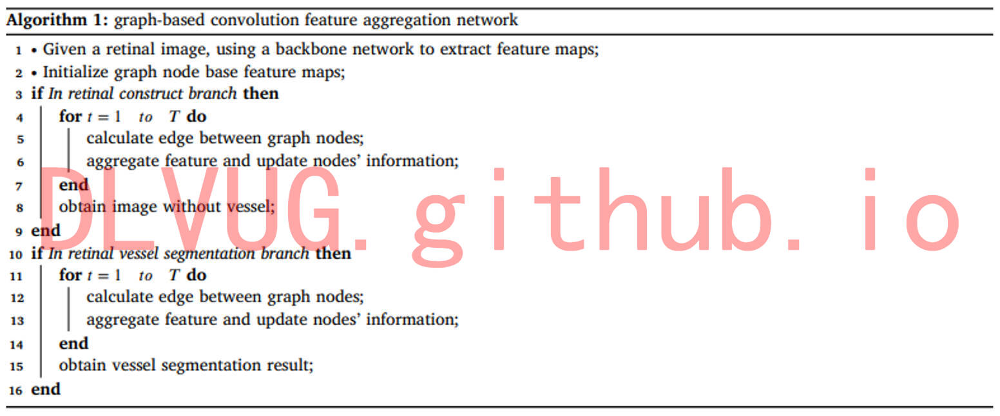
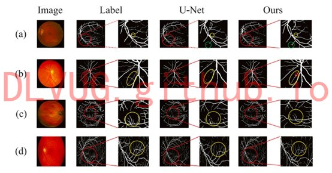
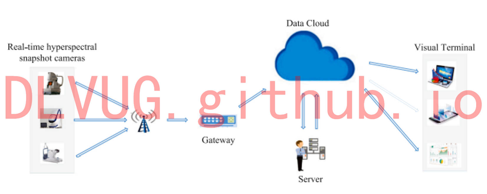

<h1>视网膜眼底图像血管分割</h1>

视网膜血管分割是计算机辅助诊断眼科疾病的关键任务。现在常用的深度学习方法大都通过逐步提取不同的尺度的特征图来进行分割，虽然取得了不错的效果，但却没有考虑不同层级特征之间的依赖关系。为了探索不同层级特征之间的依赖关系，我们借助图关系网络来传播和聚集跨层级特征的信息，提出了一种基于图的卷积特征聚合网络。该网络由三个模块组成：特征提取模块、低层特征聚合模块、高层特征聚合模块。特征提取模块主要用来提取不同层级的视觉特征，用来供后面两个模块使用；低层特征聚合模块利用提取到的浅层特征对视网膜图片进行分割；高层特征聚合模块利用提取到的深层特征来对视网膜图片进行增强，得到了去除血管的视网膜图片，方便医生观察和诊断。最后，结合我们的算法构建物联网框架，对不同地点的各种眼底相机图像进行分析，并在PC和手机上同时显示结果。

 

 

 

