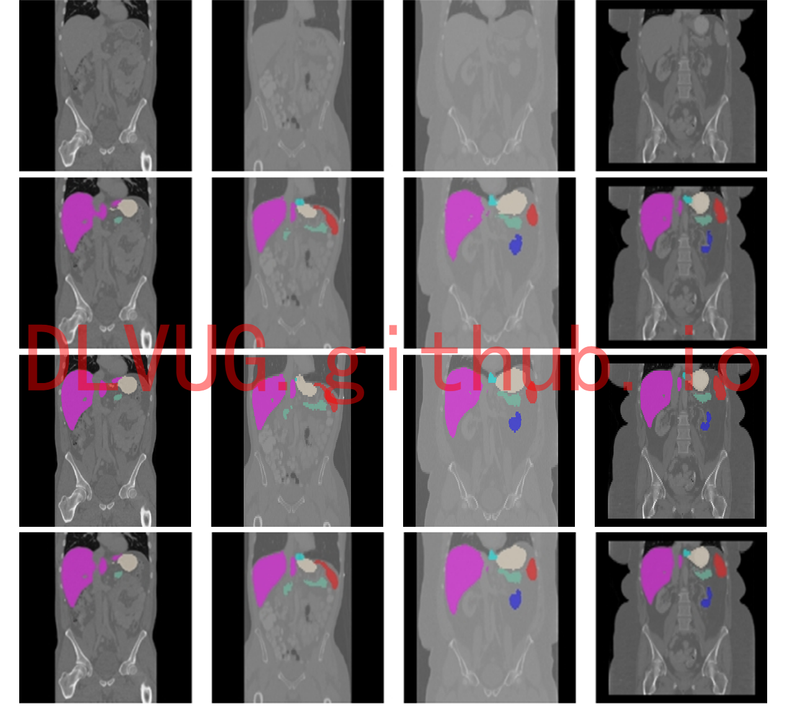
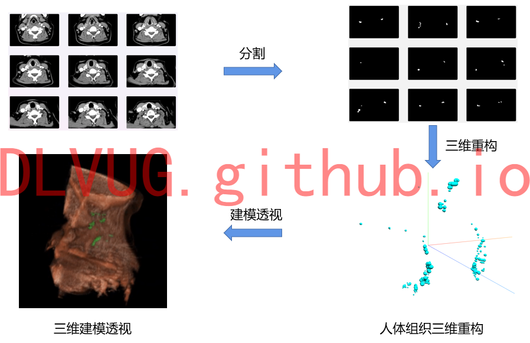

<h1>医学影像三维重建及可视化系统</h1>

在医学图像中，有许多三维医学图像数据，将每一个三维医学图像切片转换为二维数据进行手工标记是不现实的，因为这其中所包含的工作量是巨大的。自从U-Net网络模型被正式提出，被发现能够很好地应用到医学图像中去，从而大大提高了医学图像分割的精度。在当前的医学影像研究中，最常见的是将两个相同的网络级联起来，首先利用其中一个网络基础单元粗略提取所学习到的特征，然后使用另一个网络基础单元对其进行改进，从而使训练得到的网络模型的效率和准确性得到显著提高。在级联网络中，通过跳跃连接，可以极大地改善系统的性能。在传统级联网路中，一般采用上一次网络的最后输出结果加入到下一个网络的输入，而不会考虑上一次网络过程中模块所学习到的特征信息。在此基础上，研究团队采用模块级别跳连接技术实现了两个网络的对应模块的连接，使整个网络的总体性能得到了极大的改善，从而达到了准确高效的人体器官或组织分割的目标。

常规 CT 二维图像缺乏三维空间观感效果，对病变特征的显示受到了较大的局限。三维重建成像是基于高质量横断面扫描影像的技术，随着高速扫描技术的发展为三维重建成像提供了可能。医学三维重建技术涉及到医学影像学、计算机图像处理、生物医学工程等多项技术，三维重建成像不仅有助于疾病诊断，也可为术前判断提供依据，从而确定手术方案，特别是病灶空间位置及手术入路的选择，二维图像不易观察，而三维重建可从多个角度整体观察。数字化技术在外科手术中的应用越来越重要，在手术前进行科学规划，能够帮助克服外科医生的视觉局限，使数据测量更加精准，诊断更为精确，手术更加精准、更加高效。手术规划的一个重要手段就是三维重建技术。通过术前手术规划，医师能根据手术需要对三维模型进行移动、旋转、透明化等操作，任意调整观察角度，直观地了解病灶。再通过虚拟现实交互技术进行模拟手术，对手术方案进行反复操作并不断修正，显著降低手术风险、减少术中决策时间，提高手术成功率。

在模拟手术切除人体病变组织的过程中，需要三维建模可视化人体结构，将待切除的组织进行准确定位透视，以便更好地理解手术过程。我们首先使用人工智能技术来从二维切片信息中分割出病变组织，然后通过三维重建技术重构出病变组织，并将其准确定位到原位置，以便能够清楚地显示出病变组织和骨骼或正常器官之间的相对位置。

使用深度学习方法从胸部X射线图像中检测胸部疾病是过去十年来的一个活跃的研究领域。胸部疾病的诊断在很大程度上取决于放射科医生的决策。在专业放射医师严重短缺的情况下，开发计算机辅助诊断胸片上胸部疾病的自动分析方法非常重要。通过将注意力机制整合到深度学习模型中，以前的许多方法在自动疾病分类方面显示出了明显的改进。然而，现有的方法侧重于使用小尺度的空间注意力，往往忽略了更大尺度的图像上下文信息关联。基于此，研究团队开发的系统提出了一个基于大尺度注意力的胸部疾病分类网络，能够考虑更大尺度的注意力引导的空间特征，具有简洁的网络结构和更少的模型参数，其训练也需要更少的时间，且具有良好的精度。系统能用于胸片疾病分类领域，作为临床上的一种疾病早期诊断的辅助工具。

