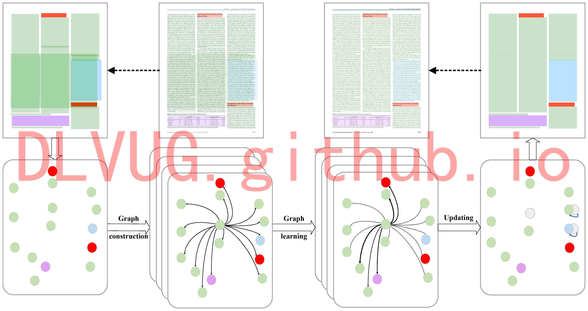
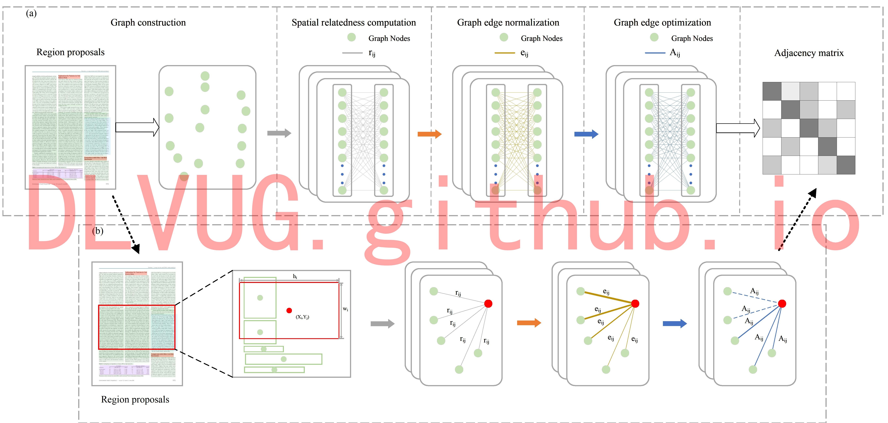
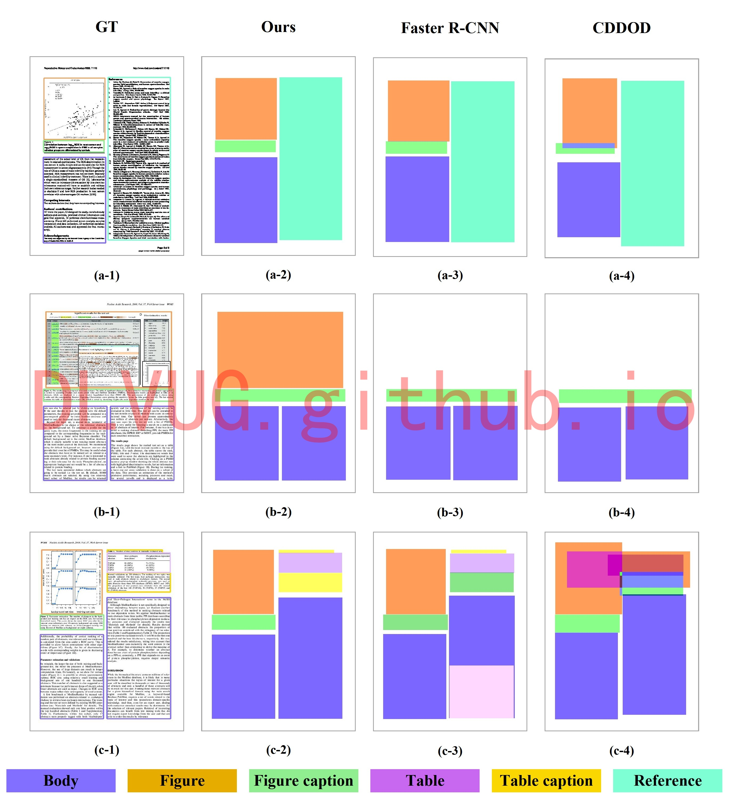
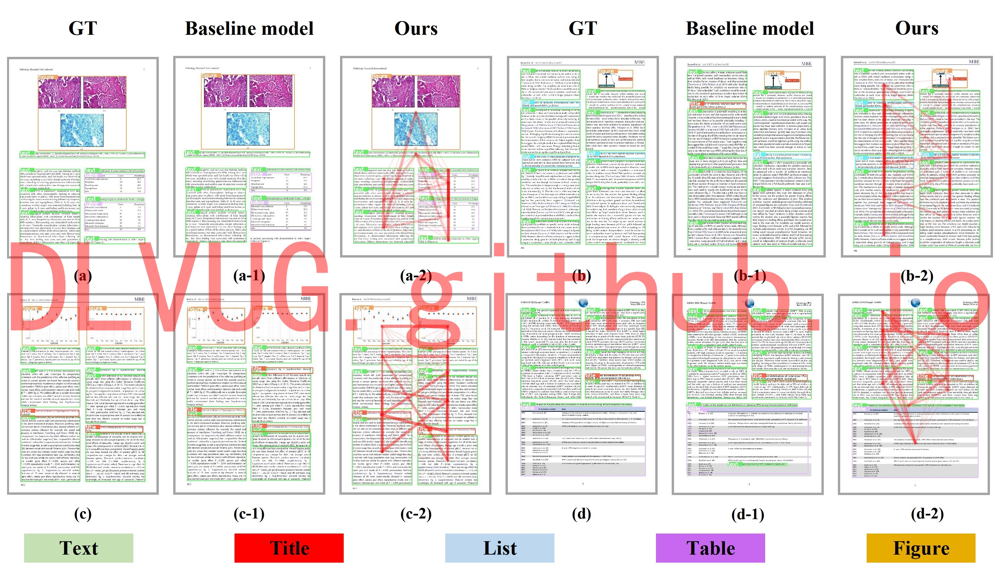

<h1>基于空间相关性的文档对象分割</h1>

文档图像理解涉及字符级别、行级别、块级别等多个级别的文档组件检测和逻辑结构恢复。文档目标检测旨在定位页面对象，如文本或非文本区域，为文档图像理解提供基础，可以广泛应用于各种应用中，如信息检索，文档编辑，文本行转录，文档结构分析。主流的深度学习背景下的文档目标检测按照信息来源大致可以分为单模态方法和多模态方法。针对现有技术的不足和缺陷，研究团队提出了一种基于空间相关关系和视觉的新型文档对象检测方法，以探索对象之间的强依赖性。具体而言，SRRV 由三个子网络组成：视觉特征提取网络、关系特征聚合网络和结果细化网络。首先，视觉特征提取网络旨在生成候选提案及其区域视觉特征表示。然后，关系特征聚合网络通过图学习网络来学习上下文信息和固有结构信息。最后，为了进一步优化和协调视觉特征提取网络和关系特征聚合网络，结果细化网络能更好地融合获得的特征表示，实现关系推理，为精确的检测结果做出贡献。部分实验结果如下图所示：

