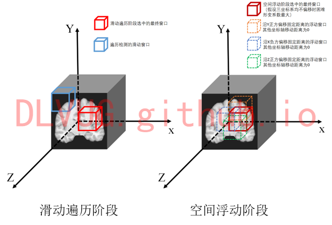
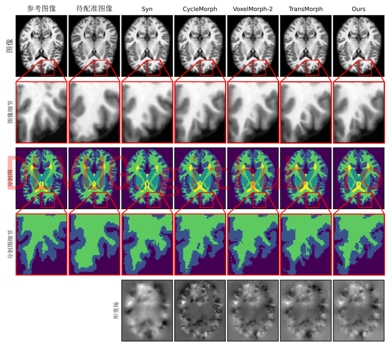
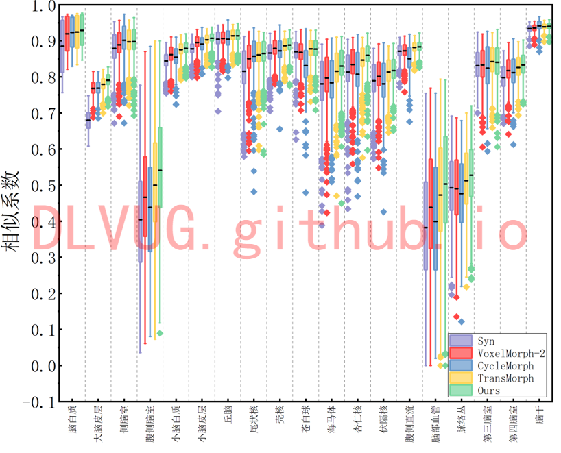

<h1>基于视觉变换器的级联多阶层医学影像配准方法</h1>

 

 

可形变医学图像配准作为医学影像处理和分析的一项基础性任务，其目标是找到参考图像和待配准图像间体素的位移关系，识别并对齐图像中相同或者相似的解剖结构，从而比较同一对象在不同条件下获取的图像。主流的深度学习背景下的可变形医学影像配准方法按照配准影像的类型大致可以分为单模态方法和多模态方法。针对图像的复杂形变问题，研究团队提供一种基于视觉变换器的级联多阶层医学影像配准方法。具体而言，该方法首先基于 Transformer 构建了基础配准网络，有效地融合图像的全局信息和局部信息，同时配备了一种基于困难形变系数的困难形变感知机，可以识别并裁剪图像的感兴趣区域。然后以困难形变感知机为桥接机制，级联了三个包含基础配准网络的阶层子网络，并且采用嵌入融合的 方式生成形变场，构建了基于 Transformer的级联多阶层配准网络模型，能够对图像中的复杂形变区域进行渐进优化。部分实验结果如下图所示：

 

 

