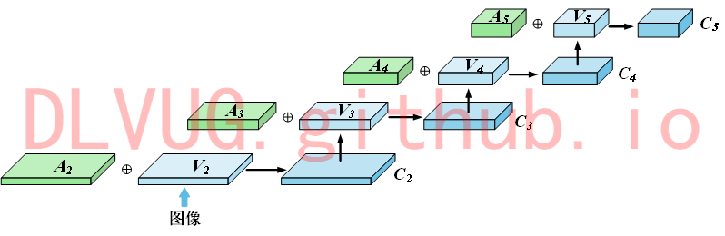
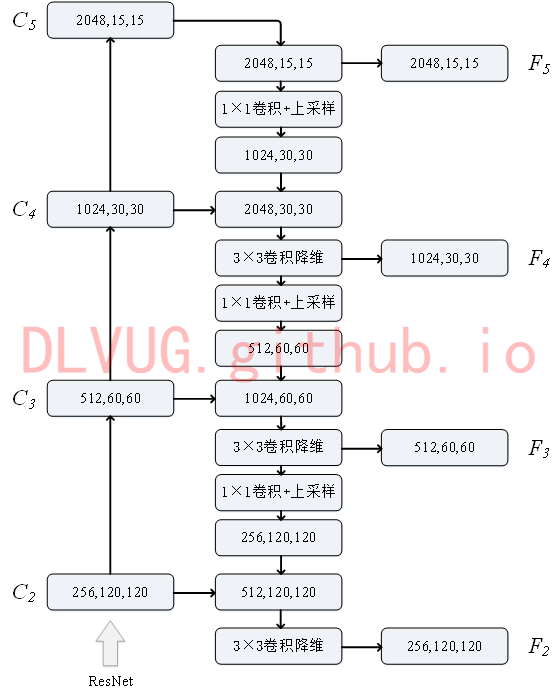

<h1>基于空间信息和视觉信息的文档目标检测器</h1>

 

 

文档图像目标检测又称页面分割或布局分析，旨在将文档图像自动识别为独立结构和逻辑单元，如文本、表格和图形。对于不同的目标区域有着不同的处理策略。由于文档图像组件的复杂性和多样性，这项工作具有挑战性。自动识别文档的整体结构，具有显著的商业价值和学术价值。国内外有很多研究学者提出了各种用于文档图像检测或分割的方法。对于基于深度学习的方法来讲，可分为基于单模态的方法和基于深度学习的方法。基于单模态特征的方法，在处理文档图像时通常局限于单一模态的特征，造成信息的浪费，并且网络性能提升有限。因此，研究团队提出了一种基于视觉和文本的多模态文档图像目标检测的方法，以利用多模态特征之间的互补信息，实现多模态特征信息的深度融合，提升整体的网络性能。具体而言，本文方法由文本特征提取模块、特征融合模块、特征增强模块、特征金字塔网络（FPN）和区域生成网络（RPN）五个模块组成。其中，文本特征提取模块利用卷积神经网络提取文本特征，实现不同模态特征之间的特征对齐。特征融合模块以ResNet网络为主，通过其强大的特征表示能力实现多模态特征的深度融合，并保留丰富的特征信息，从而使二者的信息得到充分利用。特征增强模块是一个金字塔网络结构，用于实现不同尺度特征的表征信息在通道上传递，使得低层特征也包含丰富的语义信息。特征金字塔网络（FPN[）将相邻层的特征图变换为相同的尺寸，然后对它们执行元素级别加法操作（对应位置元素相加），目的是为了将高层特征中的强语义信息传递到低层特征中，实现低层次高分辨率信息和高层次强语义信息的结合，从而提升检测性能。区域生成网络（RPN）主要由卷积层、中间层、分类层和回归层组成，其本质是基于滑动窗口和锚框机制在特征图上对目标区域进行分类和回归，并产生一系列的候选区域。部分实验结果如下图所示：

 

