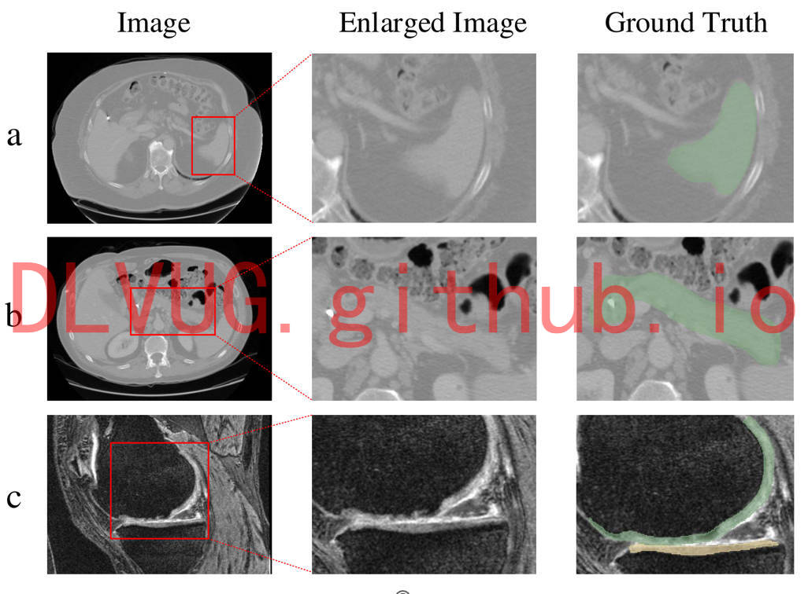
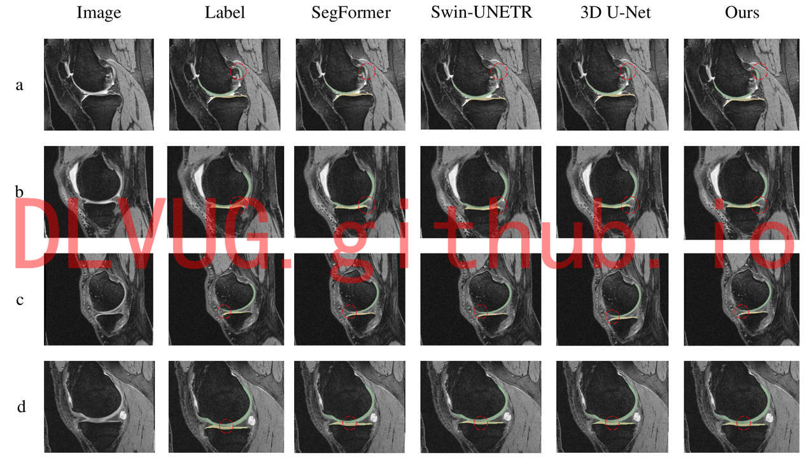

<h1>膝关节软骨分割</h1>

 

 

研究团队提出的带有边界信息transformer模型，实现了在三维空间中对膝关节软骨的精确分割，这得益于transformer编码器的多尺度特征表示，同样证明了边界信息在分割任务中的重要性。改模型在三个公开数据集上的表现超越了其他的医学图像分割模型，实现了对离群点、过分割和错误标记问题的缓解。

同时，我们认为边界信息还可以用在其他自然场景的任务中，在视觉和量化指标上双双达到好的结果。

The proposed transformer model with boundary information achieves accurate segmentation of knee cartilage in 3D space, thanks to the multi-scale feature representation of the transformer encoder, which also proves the importance of boundary information in the segmentation task. Our performance on three public datasets outperforms other medical image segmentation models, achieving mitigation of outliers, over-segmentation, and mislabeling problems.

At the same time, we believe that boundary information can also be used in other natural scene tasks to achieve good results in both visual and quantitative metrics.

